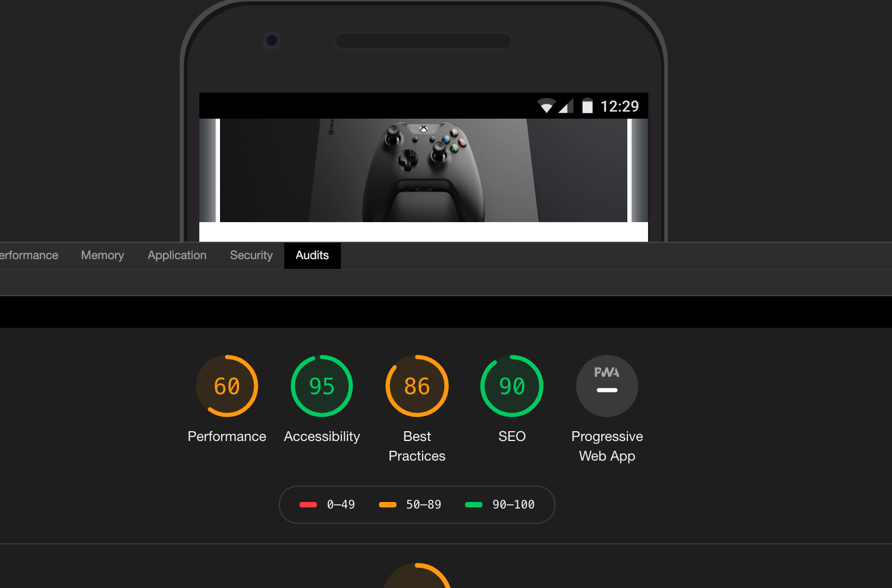

# Authorization Page + PWA


The task was to build a UI for my products page while connecting it to my own MongoDB Atlas Database. Only allowing the admin to login and see the products to manipulate them if needed. Created a PWA to allow anyone to add this to their home screen on their phone! This task was built and launched on Heroku by Reginald Johnson Jr
https://authreggie.herokuapp.com/

# Prerequisites & Installation!
```
   1.   git clone the repository
   2.   open in code editor
   3.     open terminal
   4.     npm install
   5.    create .env with your own local mongoDB
   6.   npm run start
  ```
  
  # Use my app on your device!
```
   1.   click on this [link](https://authreggie.herokuapp.com/) on your device
   2.   click the button to share 
   3.   scroll down and find the button that says "add to homescreen"
   4.   click confirm
   5.   have fun!
  ```
  
  ##  Audits
  
  ### Pre-PWA
  
  
  
  ### Post-PWA
  
  


##  Languages & Tools
  - __React__ is used for the UI
  - __MongoDB__ is used for our database to record products and personal user information
  - __node.js__  evented I/O for the backend
  - __Express__ using Express to connect endpoints from our database to our UI
  - __Morgan__ to log when a client hits our endpoints
 


## Authors

Author(s) contributed to all back-end and front-end code to this project. All author(s) contributed to deploying

| Name | Github Links |
| ------ | ------ |
| Reginald Johnson | [https://github.com/rtjohnson0]|


License
----

MIT - This project is licensed under the MIT License - see the [LICENSE](LICENSE) file for details


   
